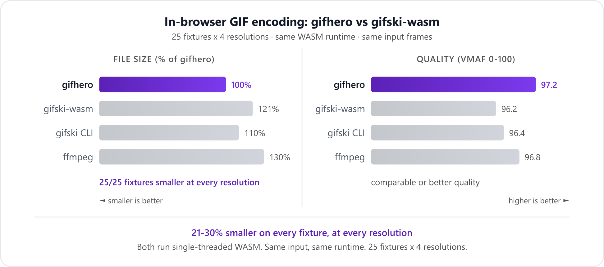

# gifhero

The best in-browser GIF encoder. **21-30% smaller files** than gifski-wasm on every fixture at every resolution, with comparable or better quality.

<p align="center">
  
</p>

## Why

There was no good way to encode GIFs in the browser. [gifski](https://gif.ski/) by [Kornel Lesiński](https://kornel.ski/) is the best GIF encoder, but it was designed as a CLI tool. Its WASM port ([gifski-wasm](https://www.npmjs.com/package/gifski-wasm)) works in the browser but can't use its main advantage: parallel quantization across threads. In the browser, both encoders run single-threaded WASM on equal footing.

gifhero was built for this environment. It uses a sub-frame transparency pipeline (texture-aware thresholding, palette fitness reuse, edge sparse suppression) that trades encoding parallelism for smaller output. In the browser, where parallelism isn't available anyway, this is a free win.

Built with [Claude Code](https://claude.ai/code) over two weeks.

## Benchmark results

25 fixtures, 4 resolutions, 8 encoders. Same input frames, same quality measurement (VMAF). Full per-fixture results in [docs/BENCHMARKS.md](docs/BENCHMARKS.md).

### gifhero vs gifski-wasm (in-browser, same WASM runtime)

| Resolution | Size wins | Avg size delta | Avg VMAF (gifhero / gifski-wasm) |
|---|---|---|---|
| **480p** | **25/25** | **-21%** | 97.2 / 96.2 |
| **360p** | **25/25** | **-28%** | 96.5 / 96.0 |
| **240p** | **25/25** | **-28%** | 96.6 / 95.8 |
| **160p** | **25/25** | **-30%** | 96.6 / 95.8 |

Smaller files on every fixture at every resolution, with comparable or better quality.

### gifhero vs gifski CLI (native, multi-threaded)

| Resolution | Size wins | Avg size delta | VMAF wins |
|---|---|---|---|
| **480p** | **17/25** | **-10%** | **20/25** |
| **360p** | **21/25** | **-16%** | 16/25 |
| **240p** | **22/25** | **-19%** | 18/25 |
| **160p** | **24/25** | **-23%** | 16/25 |

gifski CLI is much faster (parallel quantization) but produces larger files on most content.

## Install

### Browser SDK

```bash
npm install gifhero
```

```typescript
import { gifhero } from "gifhero/browser";

const gif = await gifhero
  .fromFile(videoFile)
  .fps(20)
  .width(480)
  .toGif();
```

### CLI

```bash
brew install Gabe-LS/tap/gifhero
```

Or build from source:
```bash
cd packages/gifhero-core
cargo build --release --features cli
```

```bash
gifhero input.mp4 -w 480 --fps 20 -o output.gif
gifhero video1.mp4 video2.mp4 video3.mp4 -w 480 -o outdir/
```

Requires ffmpeg on PATH.

## How it works

Two passes: **probe**, then **encode**.

The probe pass scans all frames in under 100ms. It builds a per-pixel static mask (which pixels never change), measures motion level and color complexity, computes gradient density, and detects scene changes.

The encode pass uses those results to drive everything. It builds a shared palette at keyframes and remaps subsequent frames against it until the palette drifts too far (measured by p95 nearest-color distance). For each non-keyframe, it computes a texture variance map, uses it to scale the stale-pixel threshold per pixel (smooth areas get tighter thresholds to prevent ghosting), checks whether the pixel is drifting in the same direction next frame, then hands the alpha-zeroed frame to imagequant with the previous canvas as background. After quantization, it suppresses isolated near-stale pixels at bounding box edges to shrink the crop rectangle, trims the palette to a power-of-2 boundary when possible (saves a bit in LZW), and composites onto the canvas for the next frame.

In the browser, the entire per-frame pipeline runs in a single WASM call via `FrameEncoder`, keeping canvas state in WASM linear memory across frames.

## Architecture

```
Browser SDK:
  VideoDecoder, Mediabunny demux, frame extraction
  JS orchestrator, WASM FrameEncoder (transparency + quantize + subframe)
  WASM Lanczos3, JS LZW, GIF

CLI (Rust):
  ffmpeg, raw RGBA frames
  Rayon parallel Lanczos3, sequential quantize + sub-frame
  Rayon parallel LZW, GIF
```

## Development

```bash
npm run build        # Build TypeScript bundles
npm run test         # Run vitest (52 tests)
npm run bench        # Benchmark: gifhero vs gifski vs gifski-wasm (sequential, accurate timing)
npm run bench:fast   # Fast: 6 fixtures, gifhero + gifski only

# Browser benchmark
npx tsx test/browser/gifski-server.ts   # Start server
open http://localhost:3333/test/browser/ # Drop a video, compare all encoders

# Rust CLI
cd packages/gifhero-core
cargo build --release --features cli
cargo test
```

## Acknowledgments

This project owes everything to [gifski](https://gif.ski/) and [Kornel Lesiński](https://kornel.ski/). The idea of passing the decoded canvas as a background to libimagequant so that dithering blends seamlessly at transparency boundaries is his. gifhero uses the same library and the same core approach. The sub-frame tricks on top are incremental. If you need a fast, reliable, proven GIF encoder for the command line, [use gifski](https://gif.ski/).

## License

MIT
